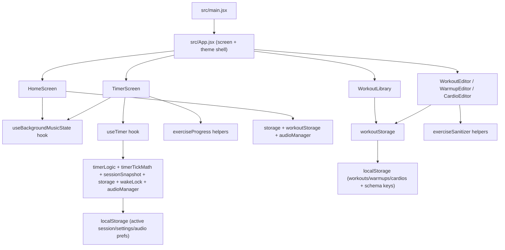

# Architecture Map

Last updated: February 15, 2026

## System Boundaries

- Client-only React application (no backend).
- Primary persistence is browser `localStorage`.
- Browser APIs used: Web Audio, Wake Lock, vibration, visibility events.
- Build/deploy: Vite build output (`dist`) and Netlify publish.

## Runtime Topology

## Data Flow

- Session start:
  - Home screen reads settings/workout templates from storage.
  - App passes selected session config to Timer screen.
  - Timer screen initializes exercise progress and timer hook.
- Active session:
  - `useTimer` maintains timing state and interval progression.
  - Timer screen owns checklist progress; metadata is persisted with session state.
- Resume flow:
  - Timer screen reads saved session.
  - `useTimer.resumeSession` reconstructs state using saved payload and derivation logic.
- Content management:
  - Library/editors perform CRUD via `workoutStorage`.
  - Migration/upsert logic runs during load and updates schema version keys.

## State Ownership

- App shell state (`screen`, editor context, theme): `src/App.jsx`.
- Timer runtime state machine: `src/hooks/useTimer.js`.
- Exercise checklist state for current view: `src/components/TimerScreen.jsx`.
- Workouts/warmups/cardios and schemas: `src/utils/workoutStorage.js`.
- Session/settings/audio prefs: `src/utils/storage.js`.
- Screen flow constants: `src/constants/appState.js`.

## Extension Points

- Add screen flows by extending App screen switch and route handlers.
- Add timer behaviors inside `useTimer` while preserving invariants.
- Keep timer math/persistence payload shaping in pure helpers (`timerTickMath`, `sessionSnapshot`).
- Add persistence fields through `storage.js` and migration-safe readers.
- Add workout entity fields by normalizing defaults and migration handlers in `workoutStorage.js`.
