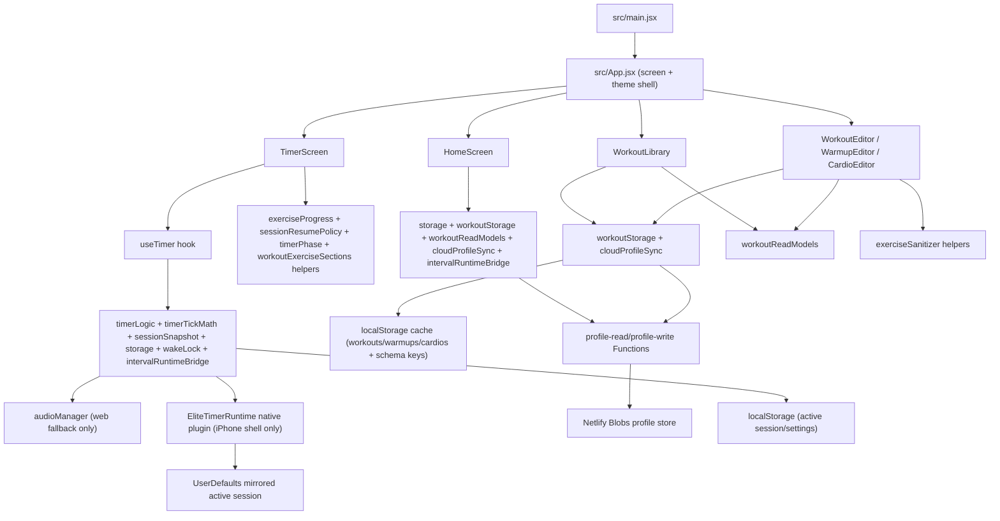

# Architecture Map

Last updated: April 21, 2026

## System Boundaries

- Client-first React application with Netlify serverless profile sync and an optional Capacitor iPhone shell.
- Workout profile persistence is Netlify Blobs (via Functions) with local cache fallback.
- Browser APIs used: Wake Lock, vibration, visibility events, and Web Audio for the web/PWA fallback runtime.
- Native iPhone runtime used when bundled in Capacitor: AVAudioSession + AVAudioEngine-backed interval cue scheduling and session projection.
- Build/deploy: Vite build output (`dist`) + Netlify publish + Netlify Functions.

## Runtime Topology

```mermaid
flowchart TD
  A["src/main.jsx"] --> B["src/App.jsx (screen + theme shell)"]
  B --> C["HomeScreen"]
  B --> D["TimerScreen"]
  B --> E["WorkoutLibrary"]
  B --> F["WorkoutEditor / WarmupEditor / CardioEditor"]
  D --> G["useTimer hook"]
  D --> N["exerciseProgress + sessionResumePolicy + timerPhase + workoutExerciseSections helpers"]
  G --> H["timerLogic + timerTickMath + sessionSnapshot + storage + wakeLock + intervalRuntimeBridge"]
  H --> S["audioManager (web fallback only)"]
  H --> T["EliteTimerRuntime native plugin (iPhone shell only)"]
  C --> I["storage + workoutStorage + workoutReadModels + cloudProfileSync + intervalRuntimeBridge"]
  E --> J["workoutStorage + cloudProfileSync"]
  E --> R["workoutReadModels"]
  F --> O["exerciseSanitizer helpers"]
  F --> J
  F --> R["workoutReadModels"]
  J --> K["localStorage cache (workouts/warmups/cardios + schema keys)"]
  P["profile-read/profile-write Functions"] --> Q["Netlify Blobs profile store"]
  I --> P
  J --> P
  H --> L["localStorage (active session/settings)"]
  T --> M["UserDefaults mirrored active session"]
```

## Data Flow

- Session start:
  - Home screen reads settings/workout templates from storage.
  - `cloudProfileSync` hydrates workout profile from Netlify (if reachable) in background.
  - App increments `profileRevision` after profile writes or cloud hydration so Home/Library remount against current local storage.
  - App passes selected session config to Timer screen.
  - Timer screen initializes exercise progress and timer hook.
- Active session:
  - `useTimer` maintains UI timing state, interval progression, wake lock, and running-session persistence cadence.
  - Timer screen owns checklist progress; `sessionResumePolicy` defines the persisted workout identity metadata, optional structure signature matching, and checklist restore behavior.
  - `timerPhase` defines a fixed 15-minute warm-up timing window for workout-backed header labels and speech milestones; timer-only sessions use a neutral header label and skip speech milestones. Attached warm-up/cardio routines remain checklist content, not timed phases.
  - `timerPhase.buildCoachingSchedule` generates a per-session motivational coaching schedule (mulberry32-seeded shuffle, ~120s cadence with ±30s jitter, 20s dead zone around structural milestones). The schedule is created once on idle/countdown → running in `TimerScreen`, embedded in session metadata as `coachingSchedule`, and consumed by the native plugin which merges structural + coaching into `combinedSpeechMilestones`.
  - Mute toggle lives on the timer header; `intervalRuntimeBridge.setRuntimeMuted` gates web-path playback and forwards to the native plugin's `setMuted`, which gates `playCueBuffer`/`playSpeechBuffer`. Timer progression and schedule advancement are independent of mute state.
  - `intervalRuntimeBridge` routes cue ownership to the native iPhone runtime when available and falls back to `audioManager` in web/PWA mode.
  - the native `EliteTimerRuntime` plugin owns interval cue scheduling, background-audio keepalive, mirrored-session persistence, and projected-session readback on iPhone.
  - `audioManager` remains the authoritative web/PWA fallback for Web Audio readiness checks, stalled-playback recovery, and the manual sound-recovery path.
- Resume flow:
  - Timer screen reads saved session.
  - when the native iPhone runtime is present, Timer screen prefers the mirrored native session over stale local web storage.
  - `useTimer.resumeSession` reconstructs timing state using saved payload and derivation logic.
  - `sessionResumePolicy` decides timing compatibility, workout identity matching, structure-signature matching, and whether saved checklist progress is restored or reset.
- Native runtime flow:
  - mirrored session updates from `useTimer.persistSession` inform the native scheduler whenever start, pause, resume, quick add, or interval transitions occur.
  - the native plugin silently fast-forwards its mirrored session when it notices stale timing and only schedules future cues from the current interval boundary onward.
  - visibility-return handling reconciles the React hook state with the projected native session so UI timing catches up without replaying missed bells from JS.
- Content management:
  - Library/editors perform CRUD via `workoutStorage`.
  - `workoutReadModels` now exposes explicit read models for Library and WorkoutEditor (`loadWorkoutLibraryData`, `loadWorkoutAttachmentOptions`) so screens do not each reconstruct profile reads independently.
  - Migration/upsert logic runs during load and updates schema version keys in local cache.
  - Save operations queue debounced profile writes to Netlify Functions (write-through sync).
  - Cloud merge ordering now resolves conflicts per section (`workouts`, `warmups`, `cardios`) using section-level timestamps, so an older update in one section does not overwrite newer data in another.
  - Default-entity deletions are tracked as tombstone ID lists to prevent default resurrection.
  - Retry/lifecycle flush handlers (`online`, `visibilitychange`, `pagehide`) improve write durability.

## State Ownership

- App shell state (`screen`, editor context, theme): `src/App.jsx`.
- Timer runtime state machine: `src/hooks/useTimer.js`.
- Platform interval runtime boundary: `src/platform/intervalRuntimeBridge.js`.
- Exercise checklist state for current view: `src/components/TimerScreen.jsx`.
- Timer workout section derivation for current view: `src/utils/workoutExerciseSections.js`.
- Saved-session compatibility and checklist restore policy: `src/utils/sessionResumePolicy.js`.
- Fixed session-phase timing policy: `src/utils/timerPhase.js`.
- Native iPhone interval runtime, mirrored session store, and background cue scheduler: `ios/App/App/EliteTimerRuntimePlugin.swift`.
- Workouts/warmups/cardios and schemas: `src/utils/workoutStorage.js`.
- Screen-facing workout sorting and attachment/library read models: `src/utils/workoutReadModels.js`.
- Cloud profile hydration/write queue: `src/utils/cloudProfileSync.js`.
- Netlify profile endpoints: `netlify/functions/profile-read.js`, `netlify/functions/profile-write.js`.
- Cloud merge/conflict policy: `netlify/profileStore.js`.
- Session/settings persistence: `src/utils/storage.js`.
- Screen flow constants: `src/constants/appState.js`.
- Voice pack pipeline: `audio-manifest/voice-pack.json` (manifest) → `audio-manifest/render.py` (local Kokoro synthesis, `bright`/`af_bella` @ 0.9) → `audio-manifest/rendered/*.wav` → `scripts/sync-voice-pack.mjs` (verify + copy) → `public/audio/` and `ios/App/App/public/audio/` bundles.

## Extension Points

- Add screen flows by extending App screen switch and route handlers.
- Add timer behaviors inside `useTimer` while preserving invariants.
- Keep timer math/persistence payload shaping in pure helpers (`timerTickMath`, `sessionSnapshot`).
- If extending the native runtime, keep cue scheduling, background-audio keepalive, mirrored-session persistence, and projected-session readback coherent as one contract.
- If extending web audio behavior, preserve the manual sound-recovery path and the fallback stalled-playback recovery behavior together.
- Add persistence fields through `storage.js` and migration-safe readers.
- Add workout entity fields by normalizing defaults and migration handlers in `workoutStorage.js`.
