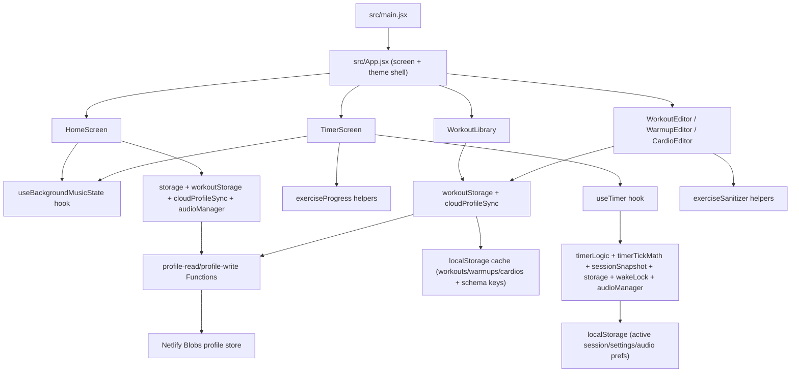

# Architecture Map

Last updated: February 15, 2026

## System Boundaries

- Client-first React application with Netlify serverless profile sync.
- Workout profile persistence is Netlify Blobs (via Functions) with local cache fallback.
- Browser APIs used: Web Audio, Wake Lock, vibration, visibility events.
- Build/deploy: Vite build output (`dist`) + Netlify publish + Netlify Functions.

## Runtime Topology

## Data Flow

- Session start:
  - Home screen reads settings/workout templates from storage.
  - Settings include `batterySaverMode`, passed through App timer config to Timer screen.
  - `cloudProfileSync` hydrates workout profile from Netlify (if reachable) in background.
  - Home/Library can re-render after hydration without blocking initial app interaction.
  - App passes selected session config to Timer screen.
  - Timer screen initializes exercise progress and timer hook.
- Active session:
  - `useTimer` maintains timing state and interval progression (RAF by default, coarse interval when battery saver is active).
  - Timer screen owns checklist progress; metadata is persisted with session state.
- Resume flow:
  - Timer screen reads saved session.
  - `useTimer.resumeSession` reconstructs state using saved payload and derivation logic.
- Content management:
  - Library/editors perform CRUD via `workoutStorage`.
  - Migration/upsert logic runs during load and updates schema version keys in local cache.
  - Save operations queue debounced profile writes to Netlify Functions (write-through sync).
  - Default-entity deletions are tracked as tombstone ID lists to prevent default resurrection.
  - Retry/lifecycle flush handlers (`online`, `visibilitychange`, `pagehide`) improve write durability.

## State Ownership

- App shell state (`screen`, editor context, theme): `src/App.jsx`.
- Timer runtime state machine: `src/hooks/useTimer.js`.
- Exercise checklist state for current view: `src/components/TimerScreen.jsx`.
- Workouts/warmups/cardios and schemas: `src/utils/workoutStorage.js`.
- Cloud profile hydration/write queue: `src/utils/cloudProfileSync.js`.
- Netlify profile endpoints: `netlify/functions/profile-read.js`, `netlify/functions/profile-write.js`.
- Cloud merge/conflict policy: `netlify/profileStore.js`.
- Session/settings/audio prefs (including battery saver preference): `src/utils/storage.js`.
- Screen flow constants: `src/constants/appState.js`.

## Extension Points

- Add screen flows by extending App screen switch and route handlers.
- Add timer behaviors inside `useTimer` while preserving invariants.
- Keep timer math/persistence payload shaping in pure helpers (`timerTickMath`, `sessionSnapshot`).
- Add persistence fields through `storage.js` and migration-safe readers.
- Add workout entity fields by normalizing defaults and migration handlers in `workoutStorage.js`.
