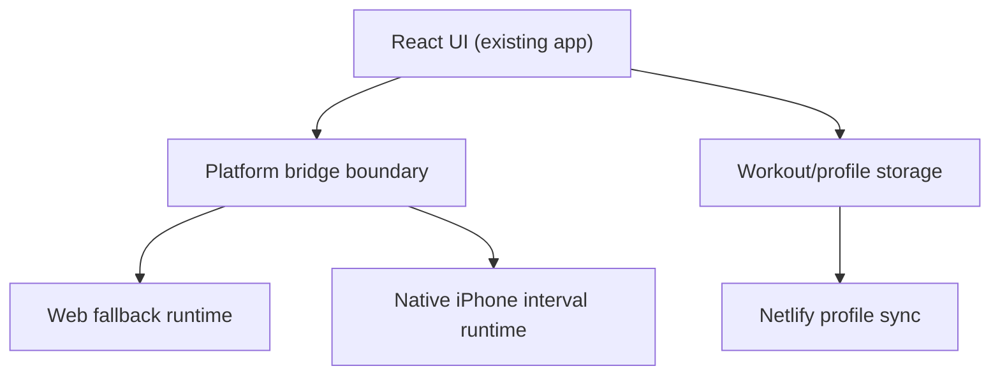

# Hybrid iPhone Migration Plan

Last updated: March 20, 2026

## Goal

Preserve the current React product surface while moving the non-negotiable workout loop onto an iPhone-native runtime:

- trustworthy elapsed/remaining time
- reliable interval cue delivery under app-switch and lock/unlock conditions

## Product Decision

The browser remains a good fit for:

- workout library CRUD
- editor flows
- local profile modeling
- cloud sync UX
- theme and visual design

The browser is no longer the long-term owner for:

- interval cue scheduling
- active-session audio lifecycle
- lock/app-switch survival guarantees

## End-State Architecture

Principles:

- keep timer math deterministic and local
- keep cue delivery local/native
- keep Netlify out of the critical workout loop
- keep the web app shippable while the native runtime is introduced

## Phased Execution

### Phase 1: Foundation

Deliverables:

- explicit runtime configuration for backend URLs
- platform bridge for interval runtime ownership
- no behavioral regression in the current web build

Success criteria:

- bundled/native builds can still resolve Netlify endpoints
- timer/audio ownership has a single swappable boundary

### Phase 2: Native Shell Spike

Deliverables:

- Capacitor iOS shell
- signed local install on the target iPhone
- minimal native plugin surface for:
  - start session
  - pause session
  - resume session
  - clear session
  - interval cue playback
  - runtime capability reporting

Success criteria:

- the app launches from an iPhone home-screen icon
- the native shell can receive session configuration from the React app

### Phase 3: Native Cue Ownership

Deliverables:

- native interval runtime becomes the authoritative interval scheduler on iPhone
- native mirrored-session projection is available for foreground catch-up and resume
- browser cueing remains the fallback for web/PWA mode
- speech announcements are optional until simple bell reliability is proven

Success criteria:

- repeated interval cues remain reliable through lock/app-switch test runs
- web mode still works without native dependencies

### Phase 4: Production Hardening

Deliverables:

- absolute backend URL configuration for native builds
- CORS/auth review for Netlify endpoints
- iPhone validation checklist and runbook

Success criteria:

- timer/audio path remains local-first
- sync remains best-effort and non-blocking

## Migration Notes

- Do not load the production iPhone app shell remotely from Netlify.
- Bundle the web UI into the native shell; use Netlify only for APIs and optional web distribution.
- The active-session runtime and audio path should not depend on network availability.
- Keep the current `R3` browser-audio work as the web fallback while native ownership is added.

## First Native Slice

The first iPhone-specific slice should be intentionally small:

1. bell only, no speech
2. React UI continues to render elapsed state, but cue and interval-boundary authority move native
3. native mirrored session can be read back after backgrounding
4. lock/app-switch validation on the target device

This keeps the riskiest variable isolated and testable.
